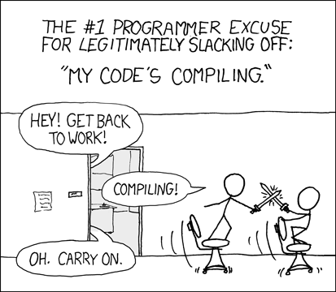
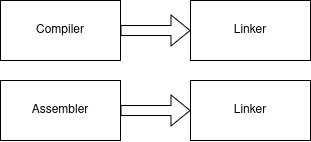

<!---
theme: default
paginate: true
--->

# From Source Code to Binary



---

##

1. How does your PC work
2. The Compiler Toolchain
3. How does it work (in Go)
4. Why is the Go compiler so fast
5. Cross-compilation
6. Assembly in Go
7. Some nice-to-know commands

---

## 1. How does your PC work

- PCs are dumb.
- Writing assembler is lots of work.
- High-level language => compiler => Low-level output

<!--
- PCs are basically pretty dumb. They have a set of instructions and you have to tell them what and in what order these should be executed. To do that, we have Assembler.
A low level language that is designed to "talk" to your CPU and tell it, what values to put in what registers and where to jump and so on...
- Writing in assembler is a little complicated and time consuming. The solution for that is high level language. But your PC still needs to know how to execute it,
since your PC can not speak that high-level language.
- This is what the compiler toolchain is for. It takes the high level language as input and outputs assembler (or rather machine code).
-->

---

## 2. The Toolchain

- Compiler
- Assembler
- Linker


<!--
- Compiler compiles your high level source code into assembly, with a few steps for optimization in between.
- The assembler takes the generated assembly code and outputs machine code (code your CPU can actually understand).
- The linker links libraries you are using in your program.
-->

---

## 3. How does it work (in Go)

- Compiler and Assembler both feed the linker with (more or less) real instructions.



---

### 3.1 Parsing

- Go Code is tokenized (lexical analysis) and parsed (syntax analysis).
- Construction of Syntax Tree

```
package main

import (
 "go/ast"
 "go/parser"
 "go/token"
 "log"
)

func main() {
 src := []byte(`package main

func main() {
  println("Hello, world!")
}
`)

 fset := token.NewFileSet()

 file, err := parser.ParseFile(fset, "", src, 0)
 if err != nil {
  log.Fatal(err)
 }

 ast.Print(fset, file)
}
```

<!--
- First, Go code is tokenized and parsed. Out of this, a Syntax Tree can be constructed, which you can actually output yourself. 
Since all the compiler and assembler functionality is written in Go, you can just import the packages and call the functions.
- For example here, we want to construct the syntax tree of a standard hello world program.
-->
---

```
0  *ast.File {
1  .  Package: 1:1
2  .  Name: *ast.Ident {
3  .  .  NamePos: 1:9
4  .  .  Name: "main"
5  .  }
6  .  Decls: []ast.Decl (len = 1) {
7  .  .  0: *ast.FuncDecl {
8  .  .  .  Name: *ast.Ident {
9  .  .  .  .  NamePos: 3:6
10  .  .  .  .  Name: "main"
11  .  .  .  .  Obj: *ast.Object {
12  .  .  .  .  .  Kind: func
13  .  .  .  .  .  Name: "main"
14  .  .  .  .  .  Decl: *(obj @ 7)
15  .  .  .  .  }
16  .  .  .  }
17  .  .  .  Type: *ast.FuncType {
18  .  .  .  .  Func: 3:1
19  .  .  .  .  Params: *ast.FieldList {
20  .  .  .  .  .  Opening: 3:10
21  .  .  .  .  .  Closing: 3:11
22  .  .  .  .  }
23  .  .  .  }
24  .  .  .  Body: *ast.BlockStmt {
25  .  .  .  .  Lbrace: 3:13
26  .  .  .  .  List: []ast.Stmt (len = 1) {
27  .  .  .  .  .  0: *ast.ExprStmt {
28  .  .  .  .  .  .  X: *ast.CallExpr {
29  .  .  .  .  .  .  .  Fun: *ast.Ident {
30  .  .  .  .  .  .  .  .  NamePos: 4:3
31  .  .  .  .  .  .  .  .  Name: "println"
32  .  .  .  .  .  .  .  }
33  .  .  .  .  .  .  .  Lparen: 4:10
34  .  .  .  .  .  .  .  Args: []ast.Expr (len = 1) {
35  .  .  .  .  .  .  .  .  0: *ast.BasicLit {
36  .  .  .  .  .  .  .  .  .  ValuePos: 4:11
37  .  .  .  .  .  .  .  .  .  Kind: STRING
38  .  .  .  .  .  .  .  .  .  Value: "\"Hello, world!\""
39  .  .  .  .  .  .  .  .  }
40  .  .  .  .  .  .  .  }
```
<!--
And here we can see what the Compiler did. It describes the whole file (package) 
with the function declaration of main and it's body.
-->

---

## 3.2 Type checking and IR construction

- Type checking
- Intermediate Representation
- Dead code elimination
- Function inlining
- etc.

<!--
- There's a bit more happening here than I am going to dive into, you just need to know that some type checking is happening here
and the "Intermediate Representation" is built here, a sort of pseudo-machine code that allows for easier optimization, like dead code elimination and function inlining.
I will show you what that looks like soon.
-->

---

## 3.3 Generic SSA

- Static Single Assignment form
- Case by case basis function replacement
- Range loop rewrite

<!--
- After the first optimizations on the IR it is converted to Static Single Assignment form, which is another low-level IR.
- It's called Static Single Assignment because every variable is assigned exactly once, which allows the compiler to 
check the program flow
- On this special IR, some functions are replaced with highly optimized code (case-by-case basis) or range loops are rewritten to for loops etc.
- Also, some more dead code elimination, unnecessary nil checks, removal of unused branches and more is happening during this conversion.
-->

---

## 3.4 Lowering and machine code generation

- Machine specifics
- "Stack Frame Layout"
- `obj.Prog` structs

<!--
- Here, generic values are rewritten into machine specific variants. Since some optimizations can only be applied machine dependant, another optimization process
is happening during this phase.
- After "lowering", another final optimization is happening with more dead code elimination, removal of local variables that are not read from and more fancy stuff.
- The "stack frame layout", which assigns offsets to variables and some Garbage Collector analysis is also done here.
- This marks the end of the SSA generation, where we end up with all functions transformed into `obj.Prog` structs, which are taken by the assembler and translated into
machine-specific instructions.
-->

---

```
type Prog struct {
 Ctxt     *Link     // linker context
 Link     *Prog     // next Prog in linked list
 From     Addr      // first source operand
 To       Addr      // destination operand (second is RegTo2 below)
 Pool     *Prog     // constant pool entry, for arm,arm64 back ends
 As       As        // assembler opcode
 Reg      int16     // 2nd source operand
 RegTo2   int16     // 2nd destination operand
  ...
}
```

<!--
Example of the Prog struct. Similar to the AST you can see stuff like From To addresses which refers to registers, as well as the "As", which describes
the assembler opcode, which is basically the instruction.
-->

---

## 4. Why is it so fast?

- Dependency handling
- Language design
- Less optimizations and configurability than other compilers

<!--
- The Go compiler is very fast, mainly because of how it handles dependencies. Only files that are imported directly are read and compiled, unlike in C for example.
- Also unused or cyclic dependencies are compilation errors in Go, so it forces you to think about the import structure.
- But there are also less ways to configure the compiler than in other languages.
-->

---

## 5. Cross-compilation

- IR / SSA for easy translation
<!--
- The guys from Go decided that almost all CPUs Go can run on, have pretty much the same assembly language,
only slightly different in register names, instruction names etc. This made it possible to write
an overall obj library, which takes input (Go code) and outputs pseudo-instructions that are the same for all
assembly languages. This means, architecture specific stuff is all coming in later, which enables the Go compiler to be so easily portable.
-->

---

## 6. Assembly in Go  

- Implement functions in Go assembly language
- For example in the [math package](https://cs.opensource.google/go/go/+/master:src/math/floor_amd64.s)
<!--
- There are functions which are better written in assembly, since it can be written more efficiently.
For example a lot of stuff in the `math` package. Therefore, the team from Go decided to just do that.
SHOW THE FLOOR EXAMPLE
-->

---

## 7. Some nice commands to play around

- `go build -gcflags -S`: builds the binary and outputs the disassembly
- `GOSSAFUNC=<func-name> go build` outputs a HTML file with all optimization steps the compiler toolchain does <!-- Show the simple example -->
- `go tool objdump <binary>` outputs disassembly for a given binary

---

## 8. Sources

[1. The Design of the Go Assembler](https://www.youtube.com/watch?v=KINIAgRpkDA)
[2. Introduction to the Go Compiler](https://go.dev/src/cmd/compile/README)
[3. Go Wiki: Compiler And Runtime Optimizations](https://go.dev/wiki/CompilerOptimizations)
